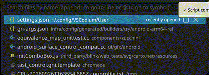
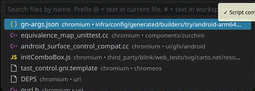
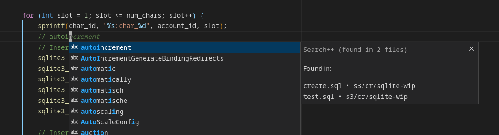
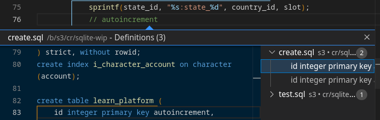

VSCode extension

# Search++

An instant, word-based full text search (FTS) for

1. Search
1. File picker
1. Autocomplete, and
1. Go to Definition.

| Default, slow | Search++, fast |
| --- | --- |
|  |  |
|  |  |





## Usage

You can **install the extension in VSCode from [the marketplace here](https://marketplace.visualstudio.com/items?itemName=phil294.search-plusplus)** or [Open VSX here](https://open-vsx.org/extension/phil294/search-plusplus).

Once the initial indexing is complete, all actions provided by this extension are instant, *regardless* of your workspace's size.

## Full takeover from the built-in search

By default, Search++ attempts a full takeover by rebinding VSCode's built-in default shortcuts for search and file picker and symbol lookup, so you don't have to configure anything.

But if you have custom keybindings, they take precendence. So you might want to explicitly configure the overrides in your shortcuts json:

```json
// On mac use cmd instead of ctrl
{ "key": "ctrl+shift+f", "command": "search++.search" },
{ "key": "ctrl+p", "command": "search++.filePicker" },
{ "key": "ctrl+shift+o", "command": "search++.goToTextInFile" },
{ "key": "ctrl+t", "command": "search++.goToTextInWorkspace" },
```

Or if you want to revert some overrides, prefix with `-`, like

```json
{ "key": "ctrl+shift+f", "command": "-search++.search" },
```

## Features

### Search


Fast, and supports searching for multiple terms that don't need to be next to each other. For example, searching for `foo bar` will yield file results containing `bar some foo`.

Searches are performed case insensitive, *unless* you include at least one uppercase letters in your query, then it's case sensitive.

Needs at least one of the search terms to consist of 3 letters or more.

Does not support Regex.

Common navigation shortcuts <kbd>F4</kbd> and <kbd>Shift</kbd><kbd>F4</kbd> are also implemented. <!-- TODO: in overrides? shortcut section -->

### File picker

<kbd>Ctrl</kbd><kbd>P</kbd> or command `Search++: Go to File`

Fast, with better result ordering.

If nothing is entered, it shows the last opened files first (1 week), or otherwise sorts by modification date. Also respects `"workbench.quickOpen.preserveInput"` setting.

Also supports `:123` line number prefixes.

Prefix `@`: Searches text in current file. Like normal symbol lookup, but plain text based.

Prefix `#`: Go to text in workspace. Workspace-wide text search. Also available via Ctrl+T, see below.

Does *not* support running commands with `>` or keywords like `debug` or `ext` yet. Use the normal picker / command input for that.

### Go to Text in Workspace

<kbd>Ctrl</kbd><kbd>T</kbd> or command `Search++: Go to Text in Workspace`

A replacement for the native `Go to Symbol in Workspace`, but plain text based.

This feature is actually very similar to the search panel. The results are the same, except this one is keyboard driven and with the search panel, you can specify include/exclude patterns instead.

### Go to Text in Current File

<kbd>Ctrl</kbd><kbd>Shift</kbd><kbd>O</kbd> or command `Search++: Go to Text in Current File`

A replacement for the native `Go to Symbol in Editor`, but plain text based.

### Autocomplete

Search++ provides instant text-based autocomplete in *all* files and positions (including comments etc) based on all workspace file contents.

### Go to Definition

Search++ hooks into all Go to Definition lookups and (only) if no other provider yielded any results, falls back to text-based searching of the current word.

This provides a basic go-to for languages with no editor support or even in text files.

## Behavior

Once installed, Search++ will immediately start reading your workspace () and maintain its index, even after reload. Everything has been heavily optimized for very large workspaces.

The first initial indexing  per workspace takes roughly 5 ms per indexable file, so typically just a few seconds in total. It's always safe to exit VSCode any time, after relaunching the indexing process will simply resume where it left off. The index is written to disk and takes up around 500 % in size of the indexable files themselves. Once complete, this process never has to run again, as the extension keeps monitoring your workspace for changes only. So the index files can grow large. You can find it in locations like `~/.config/Code/User/workspaceStorage/[ID]/phil294.search-plusplus/index/index6.db`.

Sample data:

[Chromium `de86887c`](https://github.com/chromium/chromium/tree/de86887c26b62e8cbdcfd54f02cec60ce6f0d156), Indexable files: `475,000`, `2.4 GiB`. Folder size: `4.9 GiB`. Initial indexing time: 12 min on Macbook Pro M3, 50 min on an ancient i3. Index size: `12.6 GiB`.

A file is considered indexable if...

- it isn't explicitly excluded with any of `"search.exclude"` / `"files.exclude"`, `"files.watcherExclude"`(¹) or `"search++.watcherExclude"` settings with the latter taking precedence if conflicting respectively
- it isn't listed in some `.gitignore`, `.rignore` or `.ignore` file, *unless* configured otherwise with any of `"search.useIgnoreFiles"` / `"search.useGlobalIgnoreFiles"` / `"search++.useIgnoreFiles"` / `"search++.useGlobalIgnoreFiles"`, with the latter ones taking precedence if set
- it doesn't exceed `"search++.maxIndexSizeMb"` MiBs (default `20`)
- its average line length doesn't exceed `"search++.maxAverageLineLength"` (default `300`)

## Configuration

The defaults should work fine in most cases, but a few things can be configured.

```jsonc
{
   "search++.verboseLogging": {
      "description": "Some basic info is always output in the dedicated Search++ output pane. You can enable lots more of diagnostic info for debugging with this setting. Keep disabled otherwise.",
      "type": "boolean",
      "default": false
   },
   "search++.watcherExclude": {
      "type": "object",
      "default": {},
      "markdownDescription": "Same format as but takes precedence over `files.watcherExclude`."
   },
   "search++.useIgnoreFiles": {
      "type": [
         "boolean",
         "null"
      ],
      "default": null,
      "markdownDescription": "Overrides `search.useIgnoreFiles`, if specified."
   },
   "search++.useGlobalIgnoreFiles": {
      "type": [
         "boolean",
         "null"
      ],
      "default": null,
      "markdownDescription": "Overrides `search.useGlobalIgnoreFiles`, if specified."
   },
   "search++.maxIndexSizeMb": {
      "type": "number",
      "default": 20,
      "markdownDescription": "Skip indexing files above this many megabytes. They still stay listed in the file picker. Applies to newly added/changed files only. You can run \"Search++: Rebuild Index\" to refresh the index."
   },
   "search++.maxAverageLineLength": {
      "type": "number",
      "default": 300,
      "markdownDescription": "Skip indexing files whose average line length exceeds this. They still stay listed in the file picker. Applies to newly added/changed files only. You can run \"Search++: Rebuild Index\" to refresh the index. This setting comes mostly into play when you have e.g. minified JS bundles in your project and either have them tracked in Git or set useIgnoreFiles:false, and not excluded with any of the exclude settings (see Readme)."
   }
}
```

## Performance

### Comparison with other IDEs

TODO

## Contributing

Please open issues in the [GitHub Repository](https://github.com/phil294/search-plus-plus-vscode-extension) for feedback, bugs and feature requests.

## Debugging

See `verboseLogging` above.

## Building

- `npm install`
- The extension does not use any sort of bundler for development or release. Just run it with the included launch script.

## Notable dependencies

- [SQLite FTS5 Extension](https://sqlite.org/fts5.html)
- [better-sqlite3](https://github.com/WiseLibs/better-sqlite3)
- [bevry/istextorbinary](https://github.com/bevry/istextorbinary)

## Notes

(¹): `"files.watcherExclude"` and `"files.exclude"` do *not* extend from one another in *normal* search ([details](https://github.com/microsoft/vscode/issues/76577)). But we follow both as Search++ is both a watcher and a search tool.
